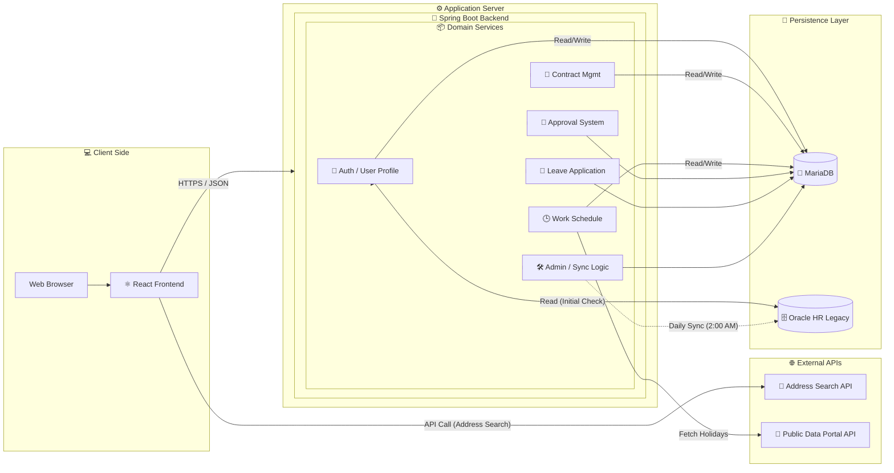

# 🗂️ 선한병원 전자 결재 시스템 (백엔드)

## 📖 소개

선한병원 전자 결재 시스템의 서버 애플리케이션입니다. 사용자 인증, 데이터베이스 연동, 근로계약서 및 휴가원, 근무현황표 동적 결재 라인 시스템을 제공합니다.

---

## 🛠️ 서버 환경

-   **Framework**: Spring Boot 
-   **Language**: Java 
-   **Build Tool**: Gradle
-   **Database**:
    -   **Main DB**: MariaDB - 사용자 추가 정보, 결재 문서 데이터 저장
    -   **Legacy DB**: Oracle - 병원 내부 인사 시스템(gshhis) 연동용
-   **Authentication**: Session/Cookie 또는 JWT 기반 인증

---

## 📐 시스템 아키텍처



## 🔗 API 명세

### 주요 API 엔드포인트

-   **인증 및 사용자 관리**
    -  `POST /api/v1/auth/sign-in` : 로그인 처리. 최초 사용자인 경우 OracleDB 조회 및 MariaDB로 데이터 이전.
    -  `POST /api/v1/auth/logout/web` : 웹 로그아웃. 쿠키 기반 JWT 토큰 삭제.
    -  `GET /api/v1/auth/verify-token` : JWT 토큰 유효성 검사.
    -  `GET /api/v1/user/me` : 현재 로그인한 사용자 정보 조회.
    -  `POST /api/v1/user/update-profile` : 프로필 정보(연락처, 주소, 서명 등) 업데이트.
    -  `POST /api/v1/user/update-profile/signature` : 전자 서명 이미지 업로드.
    -  `GET /api/v1/user/me/department-users` : 내가 속한 부서의 직원 목록 조회.

-   **근로계약서 관리**
    -  `GET /api/v1/employment-contract` : 근로계약서 목록 조회
    -  `GET /api/v1/employment-contract/my-status` : 현재 로그인한 직원의 근로계약서 상태 조회
    -  `POST /api/v1/employment-contract` : 새 근로계약서 생성
    -  `GET /api/v1/employment-contract/{id}` : 특정 근로계약서 상세 조회
    -  `PUT /api/v1/employment-contract/{id}` : 근로계약서 양식 수정
    -  `PUT /api/v1/employment-contract/{id}/send` : 근로계약서 전송
    -  `PUT /api/v1/employment-contract/{id}/sign` : 직원 서명
    -  `PUT /api/v1/employment-contract/{id}/return` : 관리자에게 반송(반려)
    -  `PUT /api/v1/employment-contract/{id}/approve` : 최종 승인
    -  `DELETE /api/v1/employment-contract/{id}` : 근로계약서 삭제
    -  `GET /api/v1/employment-contract/{id}/pdf` : 근로계약서 PDF 다운로드
    -  `GET /api/v1/employment-contract/completed` : 완료된 근로계약서 목록 조회
    
-   **휴가원 관리**
    -  `POST /api/v1/leave-application/create` : 휴가 신청서 초안을 작성합니다.
    -  `PUT /api/v1/leave-application/update` : 기존 휴가 신청서를 수정합니다.
    -  `GET /api/v1/leave-application/list` : 모든 사용자의 휴가 신청 목록을 페이지로 조회합니다.
    -  `GET /api/v1/leave-application/list/my` : 현재 사용자의 휴가 신청 목록을 조회합니다.
    -  `GET /api/v1/leave-application/{id}` : 특정 휴가 신청서의 상세 정보를 조회합니다.
    -  `POST /api/v1/leave-application/submit/{id}` : 작성된 휴가 신청서를 제출합니다.
    -  `PUT /api/v1/leave-application/approve/{id}` : 휴가 신청서를 승인합니다.
    -  `PUT /api/v1/leave-application/reject/{id}` : 휴가 신청서를 반려합니다.
    -  `PUT /api/v1/leave-application/cancel/{id}` : 제출된 휴가 신청을 취소합니다.
    -  `PUT /api/v1/leave-application/transfer/{id}` : 결재자를 변경합니다.
    -  `GET /api/v1/leave-application/substitutes` : 대리 근무자 목록을 조회합니다.
    -  `GET /api/v1/leave-application/approvals` : 승인 대기 중인 문서 목록을 조회합니다.
    -  `DELETE /api/v1/leave-application/{id}` : 특정 휴가 신청서를 삭제합니다.
 
-   **근무표 관리
    -   `GET /api/v1/work-schedule` : 근무표 목록 조회 (년/월/부서 필터링).
    -   `POST /api/v1/work-schedule` : 새 근무표 생성.
    -   `GET /api/v1/work-schedule/{scheduleId}` : 근무표 상세 정보 조회.
    -   `POST /api/v1/work-schedule/{scheduleId}/entries` : 근무표 상세 내용(직원별 근무) 일괄 저장.
    -   `PUT /api/v1/work-schedule/{scheduleId}/status` : 근무표 상태 변경 (작성중, 승인대기 등).
    -   `GET /api/v1/work-schedule/my-draft` : 내가 작성 중인 임시 저장 문서 조회.
    -   `GET /api/v1/work-schedule/entries/department` : 부서별 월간 근무 현황 데이터 조회.
    -   `GET /api/v1/dept-duty-config/schedule/{scheduleId}` : 해당 근무표의 당직/근무 모드 설정 조회.
    -   `POST /api/v1/dept-duty-config` : 근무표 관련 설정 저장 (초안 상태일 때만 가능).

-   **결재 라인 관리
    -   `POST /api/v1/approval-lines` : 결재 라인 생성 및 승인 요청.
    -   `GET /api/v1/approval-lines/candidates` : 결재 승인자 후보 목록 조회 (팀장, 부서장 등).
    -   `GET /api/v1/approval-lines/document/{documentType}/{documentId}` : 특정 문서의 결재 진행 상황 조회.
    -   `PUT /api/v1/approval-lines/{lineId}/approve` : 결재 승인 처리.
    -   `PUT /api/v1/approval-lines/{lineId}/reject` : 결재 반려 처리.

-   **문서 관리**
    - `GET /api/v1/user/reports/documents` : 문서 현황 보고서를 조회하며, 상태별 문서 개수를 반환합니다.
    - `GET /api/v1/user/reports/documents/list` : 문서 상태를 기반으로 문서 목록을 페이지로 조회합니다.

-   **휴가 정보 관리**
    -  `GET /api/v1/vacation/history/{userId}`: 특정 사용자의 휴가 사용 내역을 조회합니다.
    -  `GET /api/v1/vacation/my-status` : 현재 사용자의 휴가 현황을 조회합니다.
    -  `GET /api/v1/vacation/my-history` : 현재 사용자의 휴가 사용 내역을 조회합니다.

-   **관리자 기능**
    - `GET /api/v1/admin/users` : 모든 사용자 조회.
    - `GET /api/v1/admin/manageable-users` : 권한에 따라 관리 가능한 사용자 목록 조회.
    - `PUT /api/v1/admin/user/update-flag` : 특정 사용자의 재직 상태(useFlag) 변경.
    - `PUT /api/v1/admin/user/update-job-level` : 특정 사용자의 직급(jobLevel) 변경.
    - `POST /api/v1/admin/permissions/grant-role/condition` : 조건에 따라 사용자 역할(Role) 일괄 부여.
    - `POST /api/v1/admin/permissions/grant-role/{userId}` : 특정 사용자에게 역할(Role) 부여.

-   **HR권한 관리**
    - `GET /api/v1/admin/permissions/check/{userId}` : 특정 사용자의 권한(Permission) 확인.
    - `GET /api/v1/admin/permissions/users/{permissionType}` : 특정 권한을 가진 모든 사용자 조회.
    - `GET /api/v1/admin/permissions/types` : 모든 권한 타입 목록 조회.

-   **인사 정보 동기화**
    - `POST /api/admin/sync/useflag/all` : Oracle DB와 MariaDB 간 전체 사용자의 useFlag 동기화.
    - `POST /api/admin/sync/useflag/changed` : 변경된 사용자의 useFlag만 동기화.
    - `POST /api/admin/sync/useflag/{userId}` : 특정 사용자의 useFlag를 개별 동기화.

---

## 🗄️ 데이터베이스

-   **(Oracle)**: 병원의 기간계 인사 DB. 로그인 시 사용자의 재직 여부(`useflag`) 및 기본 정보(`usrid`, `usrkorname`, `deptcode`, `jobtype`)를 조회하는 데 사용됩니다.
-   **(MariaDB)**: 본 시스템의 메인 DB. `oracle`에서 가져온 사용자 정보와 추가된 개인정보(연락처, 주소, 서명이미지 경로 등) 및 모든 결재 문서 데이터를 저장하고 관리합니다.

---

## 🚀 배포 및 실행 방법

1.  **저장소 복제**
    ```bash
    git clone {backend_repository_url}
    cd {repository_name}
    ```

2.  **환경 변수 설정**
    `application.properties` 파일에서 두 개의 데이터베이스 접속 정보를 환경에 맞게 설정합니다.

    ```properties
    # MariaDB (Main DB)
    spring.datasource.url: jdbc:mariadb://100.100.100.224:3306/sunhan
    spring.datasource.username: {db_user}
    spring.datasource.password: {db_password}

    # Oracle (Legacy DB for User Verification) - 별도 DataSource로 설정
    # 예시:
    # oracle.datasource.url: jdbc:oracle:thin:@100.100.100.21:1521:gshhis
    # oracle.datasource.username: {user}
    # oracle.datasource.password: {password}
    ```

3.  **프로젝트 빌드**
    ```bash
    ./gradlew build
    ```

4.  **서버 실행**
    ```bash
    java -jar build/libs/*.jar
    ```
    서버는 기본적으로 `9090` 포트에서 실행됩니다.

---

## 📄 문의

-   **Contact**: dudgus2109@gmail.com
